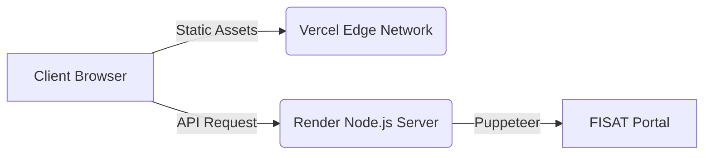

# Bunkable - Project Overview

**Bunkable** is a custom-built, modern attendance tracking dashboard designed specifically for students at the Federal Institute of Science And Technology (FISAT). It acts as a sleek, dynamic frontend that interfaces with a powerful, headless scraping backend to extract and analyze student attendance records in real-time.

---

## 🏗️ Architecture

The project is decoupled into two separate environments to optimize for both speed (static edge delivery) and heavy computation (headless browser scraping).



### 1. The Frontend (Client-Side)
- **Hosting:** Deployed statically via **Vercel** for lightning-fast, global CDN delivery.
- **Technologies:** Pure Vanilla HTML, CSS, and JavaScript. No heavy frameworks (like React or Angular) are used, ensuring absolute minimum load times.
- **Design System:** Features a highly modern, "glassmorphic" aesthetic with a deep dark theme (`Zinc-950`) and neon `Electric Lime` accents. Typography is powered by Google's *Bricolage Grotesque*.
- **Features:** 
  - Dynamic login UI with robust, inline error reporting.
  - Interactive dashboard showing subject-wise attendance.
  - "Target Attendance" calculator that dynamically computes exactly how many classes a student can afford to miss (or needs to attend) to maintain their target percentage.

### 2. The Backend (Server-Side)
- **Hosting:** Deployed as a Dockerized web service on **Render**.
- **Technologies:** Node.js, Express.js, and Puppeteer (Headless Chrome).
- **Core Engine:** Since the FISAT portal does not expose a public API, the backend acts as a stealthy headless browser.
  - It receives the student's credentials via a secure POST request.
  - It spins up an invisible Chromium instance, navigates to the FISAT intranet, fills in the login form, and bypasses the navigation structures.
  - It elegantly scrapes the deeply-nested HTML tables on the attendance page, parses the data into clean JSON, and closes the browser securely.
- **Error Handling:** Intelligently detects bad credentials, portal downtime, or slow networks and pipes exact error messages directly back to the frontend.

---

## 📂 Repository Structure

The entire codebase is housed within a unified GitHub repository:

```text
navneet-nandesh/Bunkable/
│
├── frontend/                  # Deployed to Vercel
│   ├── index.html             # The main UI (Login + Dashboard)
│   ├── styles.css             # Glassmorphism design system & animations
│   ├── app.js                 # API interactions, UI state, and logic
│   └── icon.png               # The Bunkable switch logo
│
├── backend/                   # Deployed to Render
│   ├── Dockerfile             # Container configuration for Puppeteer + Chrome
│   ├── package.json           # Node dependencies (Express, Puppeteer, Cors)
│   └── server.js              # The core Express API & scraping logic
│
└── .gitignore                 # Excludes node_modules and local secrets
```

---

## 🚀 Deployment Pipeline

The project utilizes a continuous deployment (CD) pipeline driven by GitHub:
1. **Developer Push:** You commit and push code to the `main` branch via `git push`.
2. **Vercel Hook:** Vercel instantly detects changes in the `frontend/` folder and invalidates the edge cache, deploying the new UI in seconds.
3. **Render Hook:** Render detects changes in the `backend/` folder, spins up a new isolated Docker container, installs the latest Chromium binaries, and gracefully swaps the live API server without dropping traffic.
